# Genius UI Enhancer

Genius is a fantastic source for lyrics, but its layout doesn't always suit the viewing experience, especially on narrower windows or when zoomed in. It has a lot of additional (and interesting!) content, but most of the time, I just want to read the lyrics. This Chromium extension gives you the option to reduce all the clutter and customize your experience to your own needs.

## ✨ Features
- Clean View: Hides the sidebar, annotations, and contribution features for the moments when you just want to sing along to the lyrics.
- Utilizes the full width of the page for the header, lyrics, and post-lyric content, supporting readability for the narrowest windows.
- Adjustable font sizes support viewing from longer distances without relying on UI-breaking page zoom.
- Provides left, center, and right alignment options for lyrics.
- Removes live concert information, the "You might also like" section, and invasive advertisements.*
- Automatically saves your viewing settings to your browser's local storage.
- Only activates on lyric and annotation pages, leaving other pages unaffected.
- Lightweight and optimized for Genius' architecture.

\*Advertisement removal is post-hoc and not thoroughly tested across different browsers. I recommend always using an ad-blocker.

## 🖼️ Visual Comparisons

<b>Logged out with no adblocker vs. Logged out with UI Enhancer</b>

  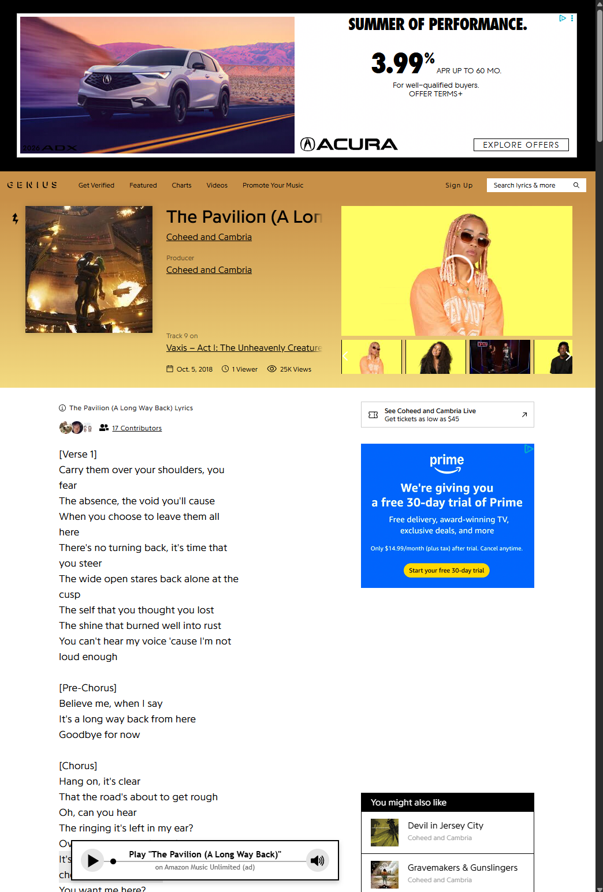
  

<b>Logged in vs. Logged in with UI Enhancer</b>

  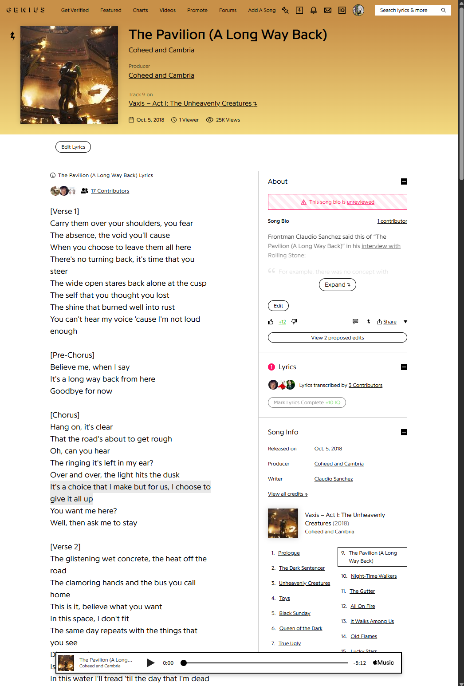
  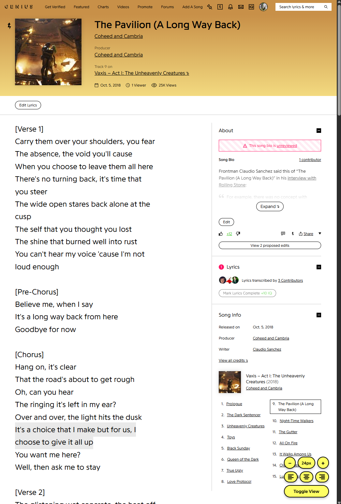

<b>Enlarging lyrics with page zoom vs. Enlarging lyrics with UI Enhancer</b>

  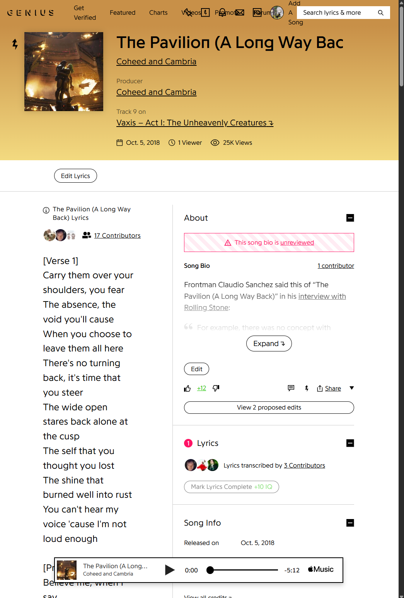
  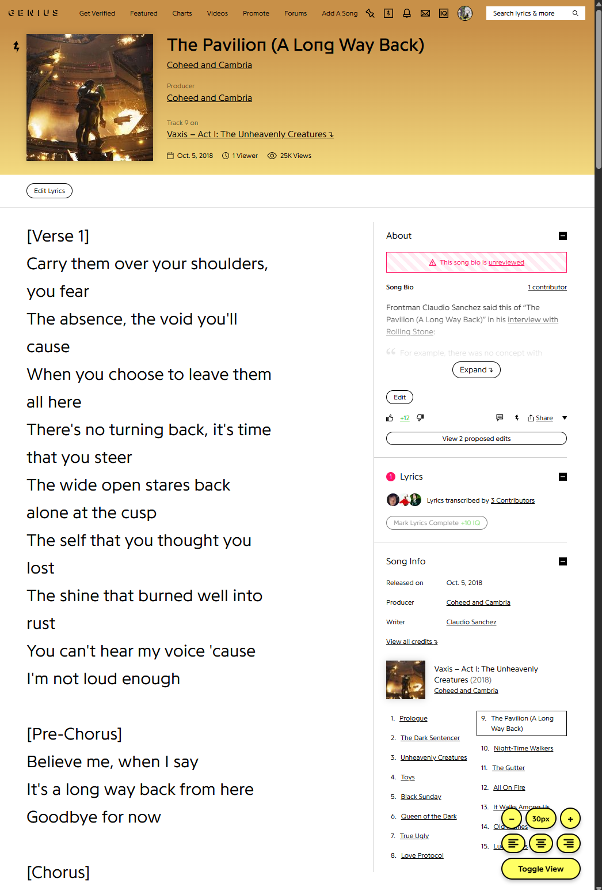

<b>UI Enhancer Default vs. Clean View: disables excess content and utilizes full page width</b>

  
  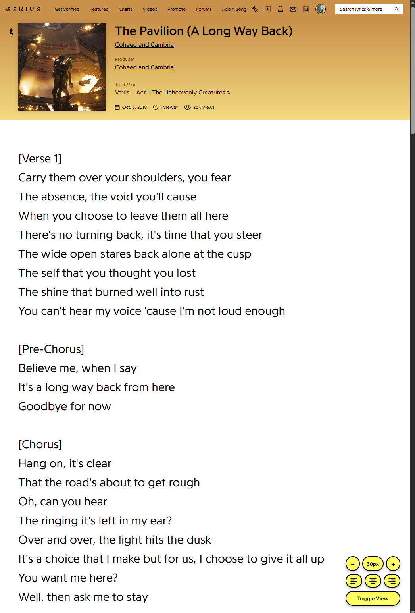

<b>Choose from a range of lyrics sizes without affecting other content</b>

  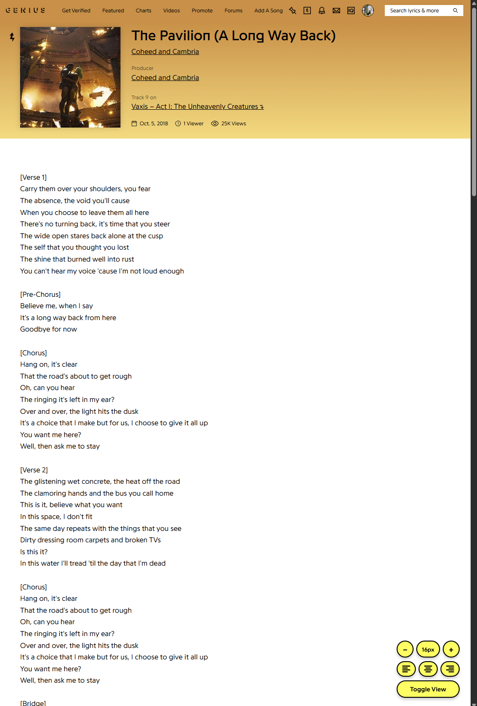
  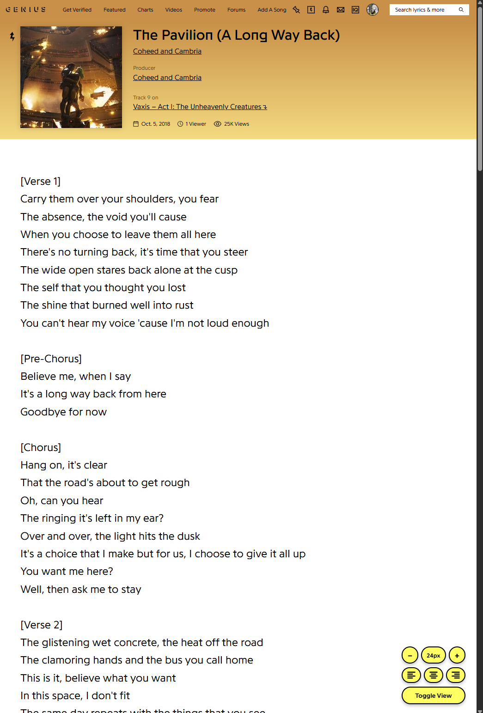
  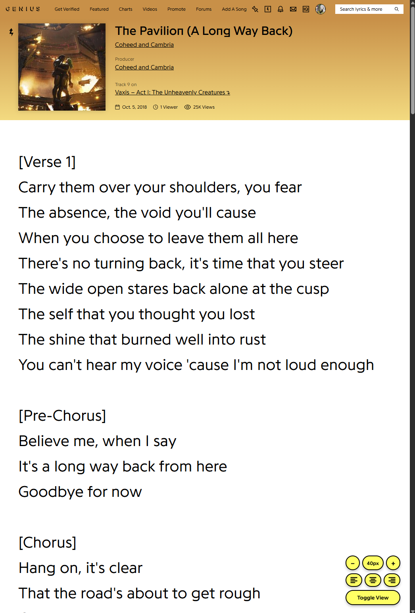

<b>Choose left, center, or right lyrics alignment</b>

  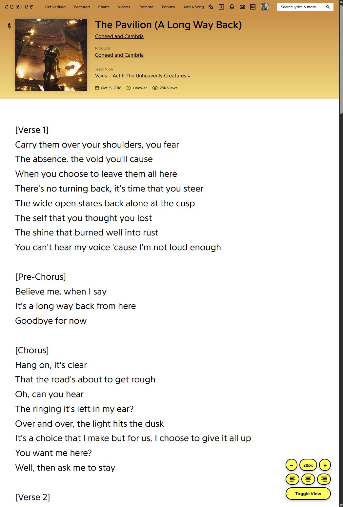
  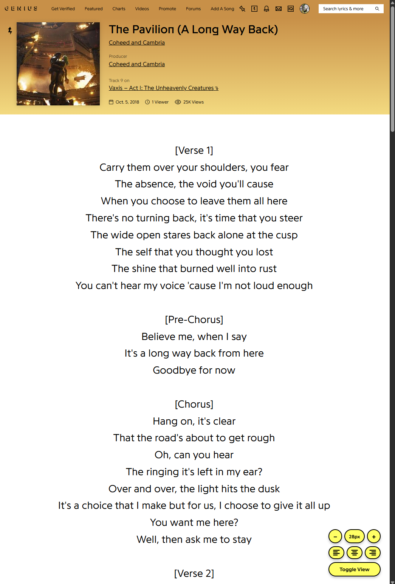
  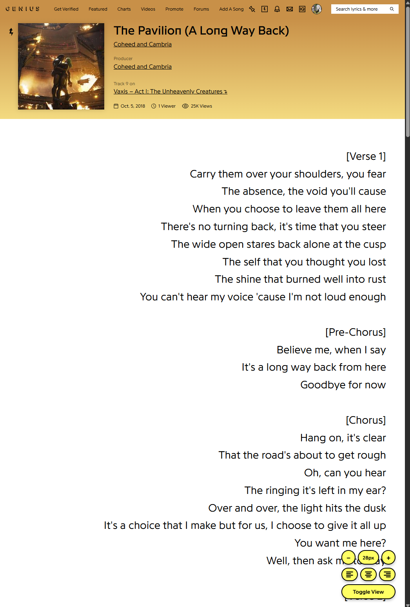
  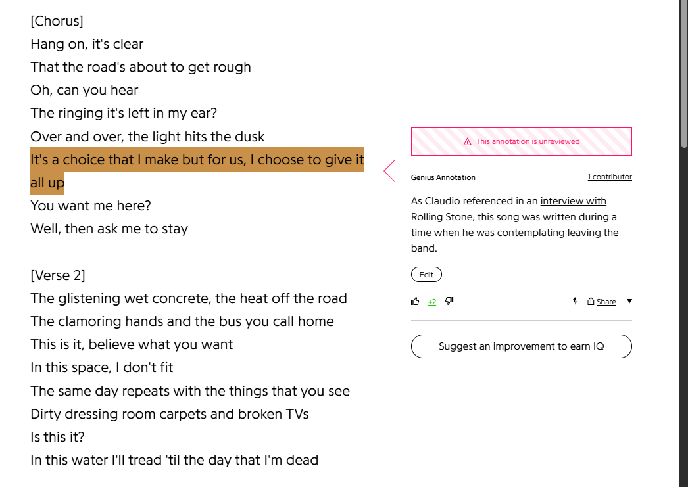
  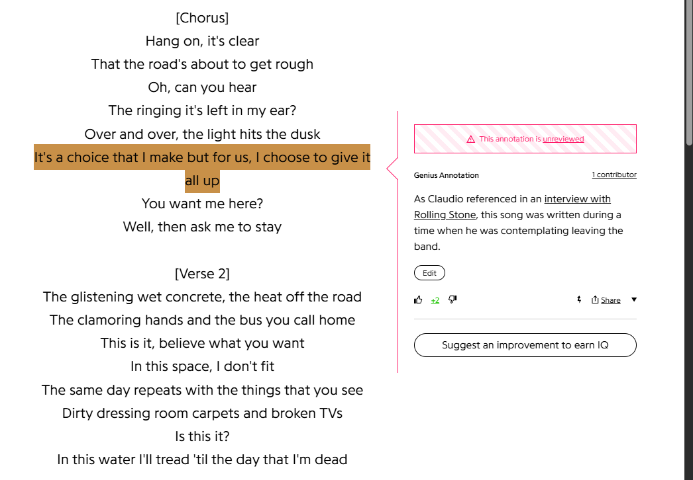
  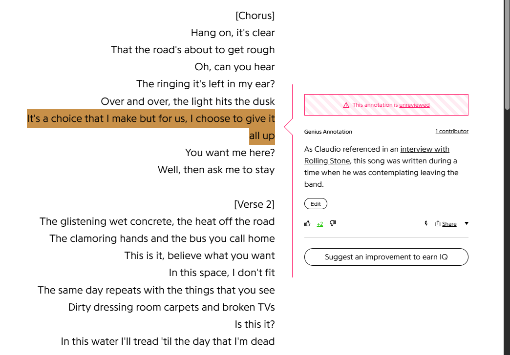

## Installation
1. Download the latest release.
2. Open your browser's extensions menu (`chrome://extensions/`, `brave://extensions/`, etc.).
4. Enable **Developer mode** (toggle in the top right).
5. Click **Load unpacked** and select the downloaded folder.
6. The extension will now be active on Genius lyric pages.

---

### If this project was valuable to you, please feel free to [fund](https://ko-fi.com/michaelvail) my matcha addiction 🍵