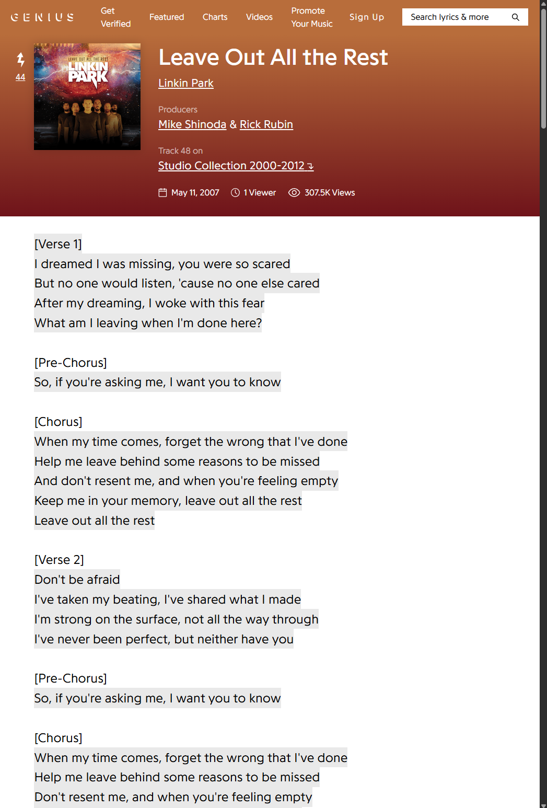
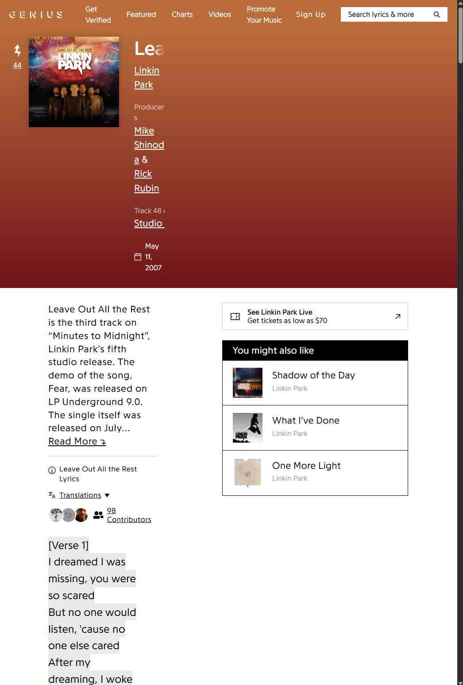
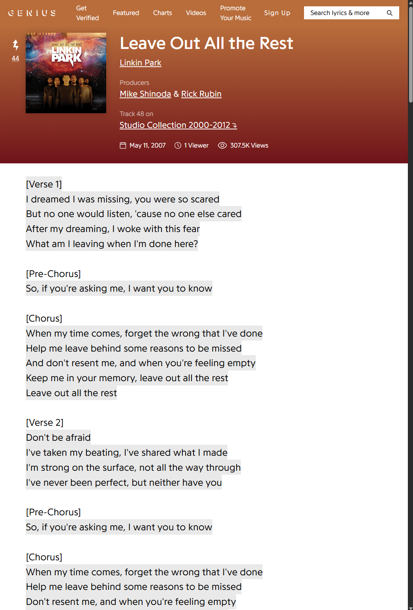

# Genius Full Width

Genius lyrics pages don't scale well with narrower windows, especially when you want to zoom in to make the lyrics bigger. This Chromium extension reduces clutter, removing the massive sidebar and extending the content width.

  Old vs. New (both on 140% zoom without adblocker) 
  
  

  Old vs. New (both on 140% zoom with adblocker) 
  
  

## Features
- Removes live concert information, "You might also like", and advertisements*
- Creates more header space for song information
- Extends width of the lyrics space**
- Only applies to lyrics pages, leaving other pages unaffected

\*Not thoroughly tested for advertisement removal across different browsers. I recommend always using an ad-blocker, anyway.

\**Opening annotations works as normal in most conditions, but there's some overlap when zoomed in on narrow windows.
  
## Installation
1. Download the latest release.
2. Open your browser's extensions menu (`chrome://extensions/`, `brave://extensions/`, etc.).
4. Enable **Developer mode** (toggle in the top right).
5. Click **Load unpacked** and select the downloaded folder.
6. The extension will now be active on Genius lyrics pages.

---

### If this project was valuable to you, please feel free to [fund](https://ko-fi.com/michaelvail) my matcha addiction.